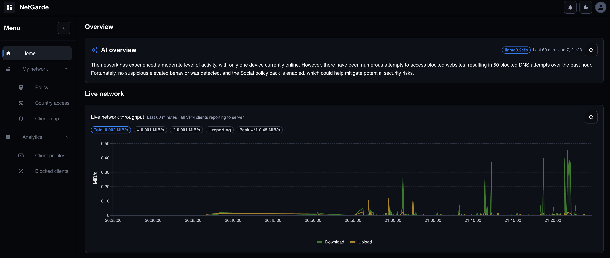
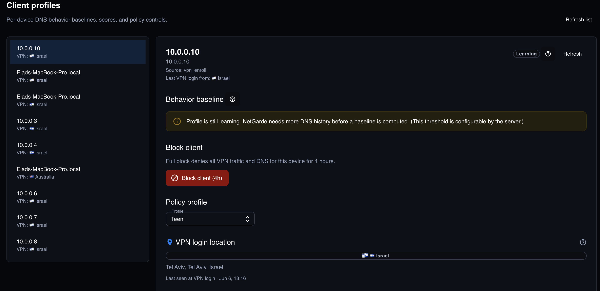
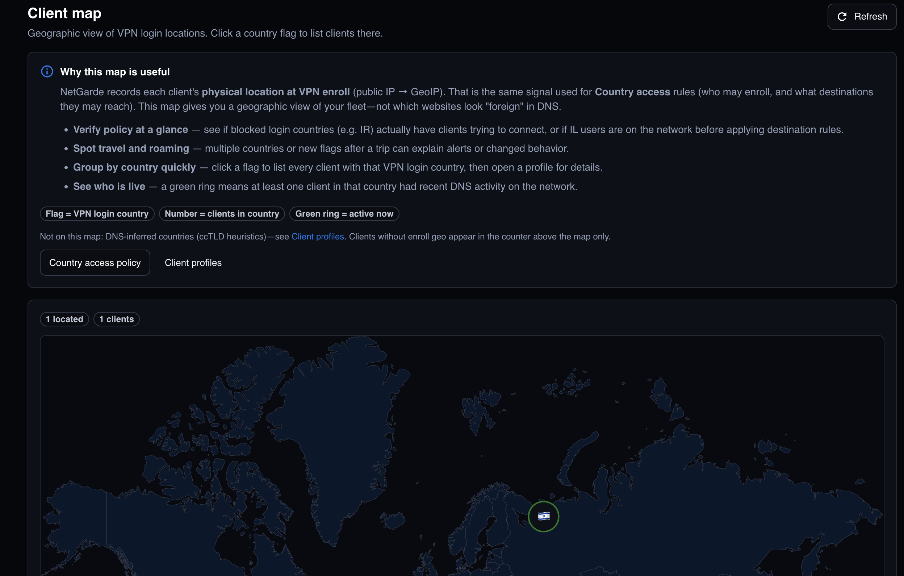

# NetGarde

**Self-hosted network security platform** — secure VPN access, DNS policy enforcement, real-time monitoring, behavior analytics, and optional AI-assisted operations.

Built end-to-end: React dashboard, FastAPI backend, WireGuard enrollment client, host-level enforcement agents, and AWS production deployment with CI/CD.

**Organization:** [github.com/NetGarde](https://github.com/NetGarde) · **Platform:** [NetGarde](https://github.com/NetGarde/NetGarde) · **Client:** [NetGardeClient](https://github.com/NetGarde/NetGardeClient) · **Docs:** [docs/README.md](docs/README.md)

---

## Overview

Most network security tools are either enterprise appliances with heavy lock-in, or consumer DNS blockers with no real visibility. NetGarde sits in between: a **self-hosted SASE-style stack** you operate on your own infrastructure.

Clients enroll over **WireGuard**. DNS flows through a central policy engine (dnsmasq + custom sync). The dashboard streams live queries over **WebSocket**, scores per-device behavior against baselines, and can quarantine clients at the network layer (iptables + DNS deny). Optional **LLM summaries** (OpenAI or Ollama) explain network and device state — detection stays rules-based.

The system is deployed on **AWS** (EC2, RDS, S3, CloudFront, ECR) with GitHub Actions pipelines, structured CloudWatch logging, and a deliberate **container vs. host** split for WireGuard and dnsmasq operations.

---

## Platform at a glance

| Capability | Implementation |
|------------|----------------|
| Secure access | WireGuard VPN, device enrollment API, IP pool allocation |
| DNS policy | Policy packs, per-device profiles, schedules, geo/country rules |
| Real-time monitoring | WebSocket live feed, Redis-backed throughput charts |
| Behavior intelligence | Per-device baselines, abnormal scoring, auto-block |
| Enforcement | Host agent (iptables quarantine), dns-sync → dnsmasq reload |
| AI operations | Network overview + behavior review (template / OpenAI / Ollama) |
| Production ops | Structured JSON logs → CloudWatch, Alembic migrations, ECR deploy |

---

## Screenshots

> More captures: [docs/images/README.md](docs/images/README.md) (recommended width ~1400px, dark theme).

### Dashboard & monitoring



### Policy & clients



### Operations



---

## Architecture

NetGarde runs as a **control plane on EC2**. Application logic lives in Docker; network enforcement runs on the host — containers cannot safely mutate WireGuard, iptables, or dnsmasq.

<p align="center">
  
</p>

| Layer | Components | Responsibility |
|-------|------------|----------------|
| **Edge clients** | Laptops, phones, enrolled devices | DNS and traffic via WireGuard tunnel |
| **EC2 host** | WireGuard, dnsmasq, iptables | VPN termination, DNS resolution, quarantine |
| **Host agents** | `netgarde-wg-agent`, `netgarde-log-watcher` | Peer apply, block/unblock, log ingest, policy sync trigger |
| **Application** | FastAPI, dns-sync, React (S3/CloudFront) | Policy engine, REST + WebSocket API, admin UI |
| **Data** | PostgreSQL (RDS), Redis, ECR | Policy state, live usage windows, container images |

**Request flows**

```
DNS:     Client → WireGuard → dnsmasq → log_watcher → API → WebSocket → Dashboard
Policy:  Dashboard → API → RDS → wg-agent → dns-sync → dnsmasq reload
Enroll:  NetGardeClient → POST /v1/enroll → wg-agent → WireGuard config
```

**Design decisions worth noting**

- **Generated dnsmasq config** — RDS is source of truth; config files are never hand-edited in production.
- **Selective DNS persistence** — Only blocked queries stored by default; full logging is opt-in (`PERSIST_ALL_DNS`).
- **Rules-based security, LLM for explanation** — Scoring and blocking are deterministic; AI summarizes for operators.
- **Feature-module monorepo** — Backend and frontend organized by domain (`policy`, `devices`, `dns_queries`, `vpn`).

Full write-up: [docs/SYSTEM_ARCHITECTURE.md](docs/SYSTEM_ARCHITECTURE.md) · [docs/DESIGN.md](docs/DESIGN.md)

---

## Tech stack

| Area | Technologies |
|------|----------------|
| Frontend | React 19, TypeScript, Material UI 7, MUI X Charts |
| Backend | Python 3.11, FastAPI, SQLAlchemy 2, Alembic, Pydantic 2 |
| Real-time | WebSocket, Redis |
| Data | PostgreSQL 16 (RDS) |
| Network | WireGuard, dnsmasq, iptables |
| Infrastructure | AWS EC2, RDS, S3, CloudFront, ECR |
| Observability | Structured JSON logging, CloudWatch Logs Insights |
| CI/CD | GitHub Actions (test → build → deploy) |
| Containers | Docker, Docker Compose |

---

## Quick start

```bash
git clone https://github.com/NetGarde/NetGarde.git
cd NetGarde
cp backend/.env.example backend/.env.development
cp frontend/.env.example frontend/.env.development
docker compose -f docker-compose.dev.yml up --build
```

| Service | URL |
|---------|-----|
| Dashboard | http://localhost:3000 |
| API + OpenAPI | http://localhost:8000/docs |

Enroll a device with [NetGardeClient](https://github.com/NetGarde/NetGardeClient).

**Developers:** [docs/DEVELOP.md](docs/DEVELOP.md) (tests, migrations) · [docs/ENV_SETUP.md](docs/ENV_SETUP.md) (configuration)

---

## Documentation

| Document | Description |
|----------|-------------|
| [docs/README.md](docs/README.md) | Documentation index |
| [docs/DESIGN.md](docs/DESIGN.md) | Architecture, domain model, code conventions |
| [docs/DEVELOP.md](docs/DEVELOP.md) | Local development, pytest, Alembic |
| [docs/DEPLOY.md](docs/DEPLOY.md) | AWS production deployment |
| [docs/API.md](docs/API.md) | REST and WebSocket API reference |
| [docs/ENV_SETUP.md](docs/ENV_SETUP.md) | Environment variables and secrets |
| [host-agent/README.md](host-agent/README.md) | EC2 host agent (WireGuard + enforcement) |

---

## License

Portfolio and educational use. See repository for terms.
